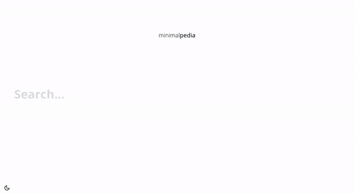

# minimalpedia
Alternative, minimalistic frontend for Wikipedia using React.

The design is based on [Dmitriy Kozhevnikov's Wikipedia Imagination](https://www.behance.net/gallery/75870375/Wikipedia-Imagination).

## Features
- One-page application using React and react-router
- Simple, minimalistic design
- Direct communication with the Wikipedia API
- Dark mode

## Usage
To use minimalpedia, visit [vantezzen.github.io/minimalpedia](https://vantezzen.github.io/minimalpedia). 
Alternatively, you can download the repository from [github.com/vantezzen/minimalpedia](https://github.com/vantezzen/minimalpedia), then install the required dependencies via `yarn install` and start the developement server with `yarn start` or build using `yarn build`.

## Available Scripts
In the project directory, you can run:

### `yarn start`

Runs the app in the development mode. 
Open [http://localhost:3000](http://localhost:3000) to view it in the browser.

### `yarn test`

Launches the test runner in the interactive watch mode.

### `yarn build`

Builds the app for production to the `build` folder.

## Contributions
Contributions of any kind are welcome!

## Bugs and feature requests
Bugs and feature request are tracked on [GitHub](https://github.com/vantezzen/minimalpedia/issues).

## Licence

